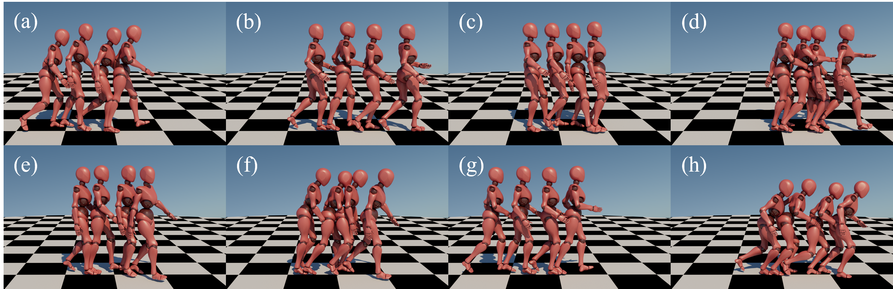

# StyledMotionSynthesis

Code for the GRAPP 2023 paper "Unifying Human Motion Synthesis and Style Transfer with Denoising Diffusion Probabilistic Models"


## Environment Setup
Please create an appropriate environment using conda: 

> conda env create -f environment.yml

> conda activate motiondiffusion

## Download Data
Xia dataset can be downloaded from https://github.com/DeepMotionEditing/deep-motion-editing and extracted into ./data.

Run data_proc/gen_dataset.sh to generate the dataset.

## Citation
```
@inproceedings{chang2022unifying,
    title={Unifying Human Motion Synthesis and Style Transfer with Denoising Diffusion Probabilistic Models},
    author={Chang, Ziyi and Findlay, Edmund J. C. and Zhang, Haozheng and Shum, Hubert P. H.},
    booktitle={Proceedings of the 2023 International Conference on Computer Graphics Theory and Applications},
    year={2022}
}
```
